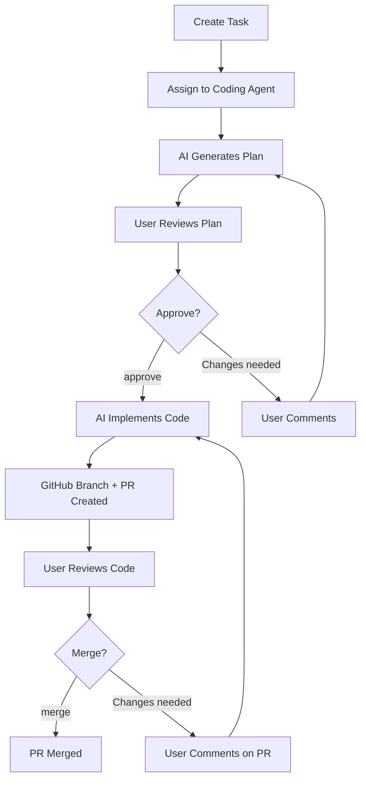

# 🤖 Astrid Agent

**Your AI-powered development assistant that turns task descriptions into production-ready code.**

---

## 📚 **Documentation**

### **Getting Started**
- **[📖 Complete Setup Guide](./README.md)** - Detailed step-by-step instructions
- **[⚡ Quick Start](./quick-start.md)** - Get running in 10 minutes
- **[📋 Setup Checklist](./setup-checklist.md)** - Ensure you don't miss any steps

### **Usage & Examples**
- **[🎯 Example Tasks](./example-tasks.md)** - Ready-to-use coding tasks to test your setup
- **[🛠 Troubleshooting](./troubleshooting.md)** - Solutions for common issues

---

## 🚀 **What Can It Do?**

The Astrid Agent can automatically:

### **📝 Plan Implementation**
- Analyze coding task requirements
- Generate detailed step-by-step implementation plans
- Consider edge cases and best practices
- Provide time estimates and technical approach

### **💻 Generate Code**
- Write production-ready TypeScript/React code
- Follow your project's existing patterns and conventions
- Include proper error handling and accessibility features
- Generate tests and documentation

### **🔄 Manage GitHub Workflow**
- Create feature branches automatically
- Commit code with descriptive messages
- Open pull requests with detailed descriptions
- Handle merging after approval

### **🎯 Handle Approvals**
- Wait for user approval via comments
- Process "approve" keywords to proceed
- Allow "merge" commands for final deployment
- Provide real-time updates via notifications

---

## 🏗 **How It Works**

---

## ✨ **Key Features**

### **🎨 Smart Code Generation**
- Follows your existing code patterns
- Integrates with your current tech stack
- Handles TypeScript types automatically
- Includes accessibility and error handling

### **🔗 Seamless GitHub Integration**
- Works with your existing repositories
- Respects branch protection rules
- Integrates with CI/CD workflows
- Maintains clean commit history

### **💬 Natural Language Interface**
- Describe what you want in plain English
- Use approval keywords like "approve" and "merge"
- Get real-time updates via comments
- No complex commands or syntax to learn

### **🛡 Enterprise Ready**
- Secure API key management
- Repository access controls
- User permission validation
- Audit trail of all changes

---

## 🎯 **Perfect For**

### **🧑‍💻 Individual Developers**
- Quickly prototype new components
- Generate boilerplate code
- Implement features from specifications
- Learn new patterns and best practices

### **👥 Development Teams**
- Standardize code patterns across team
- Speed up feature development
- Reduce repetitive coding tasks
- Maintain consistent code quality

### **🚀 Startups & Agencies**
- Accelerate MVP development
- Handle multiple client projects efficiently
- Scale development without hiring
- Maintain high code quality standards

---

## 🛠 **Technical Requirements**

### **Supported Tech Stack**
- **Frontend:** React, Next.js, TypeScript
- **Styling:** CSS Modules, Tailwind CSS, Styled Components
- **Backend:** Node.js, API Routes, Serverless Functions
- **Database:** PostgreSQL, Prisma ORM
- **Version Control:** GitHub (required)

### **AI Services**
- **Claude** (Anthropic) - Recommended for code quality
- **OpenAI GPT-4** - Great for general programming tasks
- **Google Gemini** - Good for complex logic and algorithms

### **Infrastructure**
- **Local Development:** Works with localhost
- **Production:** Deploy to Vercel, Netlify, or any Node.js host
- **Database:** PostgreSQL (local or hosted)
- **GitHub:** Repository access and webhook support

---

## 📊 **Success Metrics**

After setup, you should see:
- **⚡ 10x faster** initial implementation
- **🎯 90%+ code accuracy** on first generation
- **🔄 Seamless workflow** from idea to PR
- **📈 Higher team productivity** and consistency

---

## 🎉 **Ready to Start?**

Choose your path:

### **🚀 I want to get started quickly**
→ **[⚡ Quick Start Guide](./quick-start.md)**

### **📚 I want detailed instructions**
→ **[📖 Complete Setup Guide](./README.md)**

### **✅ I want to follow a checklist**
→ **[📋 Setup Checklist](./setup-checklist.md)**

### **🎯 I want to see examples first**
→ **[🎯 Example Tasks](./example-tasks.md)**

---

**Transform your development workflow today with AI-powered coding assistance!** 🚀✨